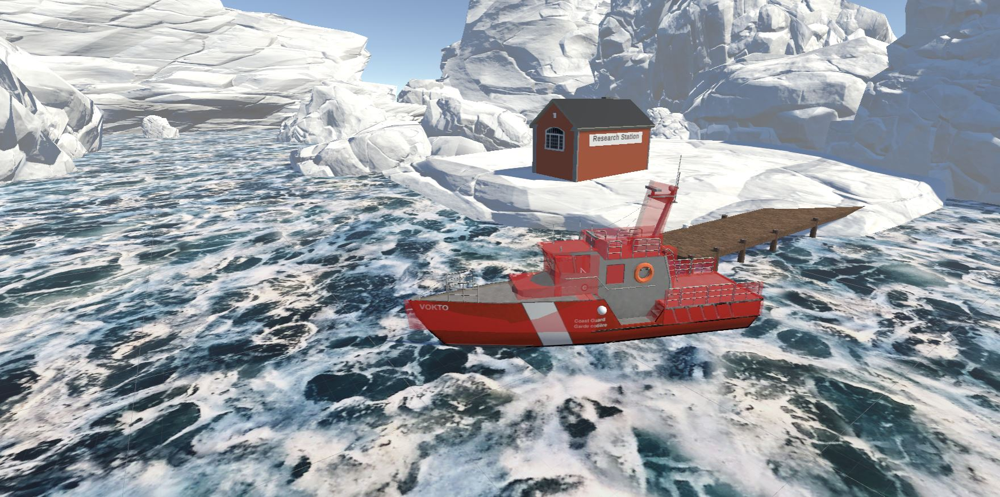
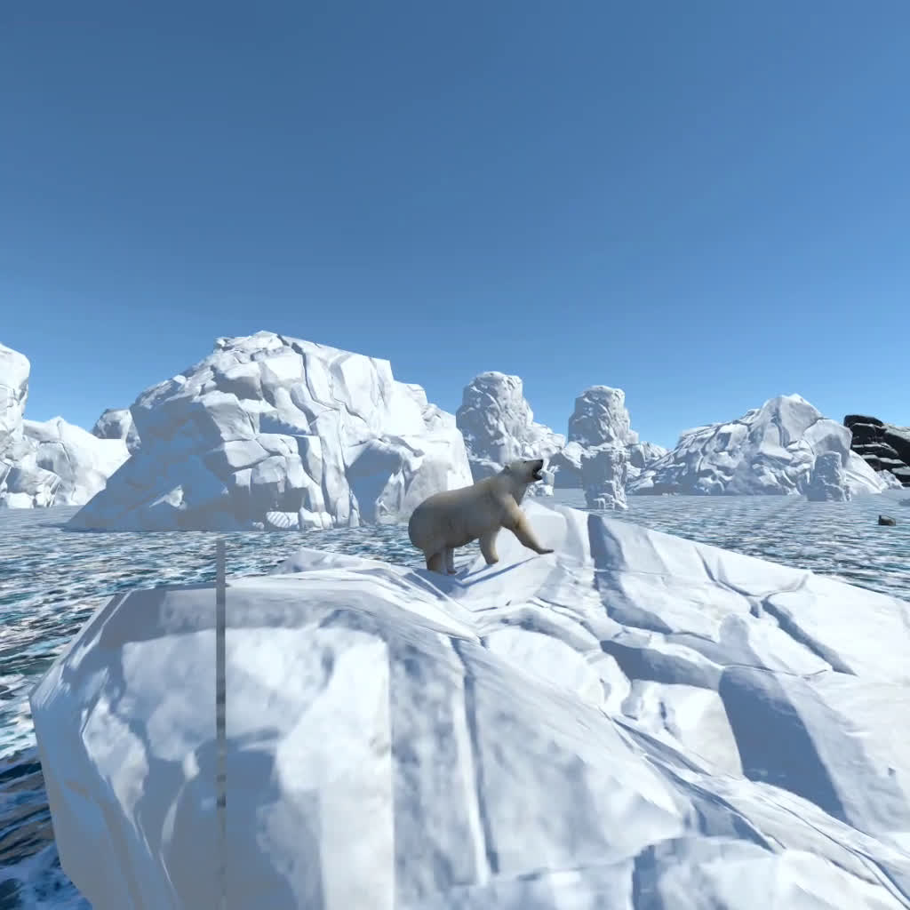

# VR-Boat
A Virtual Reality game/scenario on a Boat, driving the boat and exploring the melting icebergs and polluted oceans. 

## Description 
A Sea environment where the player navigates a boat.

The surroundings are icebergs that melt, some animated animals are present. 

The player can pick up some objects floating. 

Built during VR Hackathon Climate Change 20-21/08/2022.

[[All my VR Projects here]](https://github.com/igor-lirussi?tab=repositories&q=virtual-reality)

### Topics:
- VR Virtual-Reality 
- Climate Change

## Result

## Requirements & Dependencies
- Unity 2021.3
- Oculus Quest 2

## Run
Download the .apk in [releases](https://github.com/igor-lirussi/VR-Boat/releases) and install it in the VR Headset

## Install Project
- clone the repository
- open with UnityHub
- go to [Installs], select your version (shold be 2021 or more, if not:[install editor]->2021.3.21) -> click the gear ⚙️ -> _Add modules_
  - check **Android build support** with the two submodules
  - check **Windows build support (IL2CPP)**
  - click _continue_ and _install_
- open the project: [Projects]-> double click "VR-Boat" or [Open]->select VR-Boat folder
- go to _File_ -> _Bulid Settings_ 
  - check there is "MainScene" in _Scenes in Build_, or add it with "Add Open Scenes"
  - select platform: _Android_
  - set texture compression: _ASTC_
  - plug your QUEST device (in [developer mode](https://developer.oculus.com/documentation/native/android/mobile-device-setup/#enable-developer-mode)) with a usb cable
  - select run device: _"Oculus Quest 2"_
  - in bottom left corner change "Max Texture Size" to _Max 2048_
  - click _Switch Platform_
- go to _File_ -> _Bulid Settings_ -> _Build and Run_

#### if you have trouble, follow [this tutorial](https://youtu.be/pNYY1JsS7tY)

<section>
  

    

      

        

          <h2 class="display-4 text-center te t-lg-left">Extras</h2>
          
Some objects/animals are present to enhance the experience

        

      

      

        

          
        

      

    

  

</section>

## Useful Resources & Extra
- Links
  - [How To Build a Unity VR project to the Oculus Quest (and other devices) ](https://www.youtube.com/watch?v=pNYY1JsS7tY)
  - [How to Make VR Games in 2022 - Updated Unity VR Tutorial](https://www.youtube.com/watch?v=yxMzAw2Sg5w&t=0s)

- Resources
  - [This is Climate Change, MIT – Docubase ](https://docubase.mit.edu/project/this-is-climate-change/)



## Authors
* **Igor Lirussi** @ BOUN Boğaziçi University - BuViar Lab
* **İpek Paksoy** @ BOUN Boğaziçi University - BuViar Lab

## Acknowledgments
*   The organizers of the event and the experts involved.
*   All the people that contributed with suggestions and tips.

## License
This project is licensed - see the [LICENSE](LICENSE) file for details.
